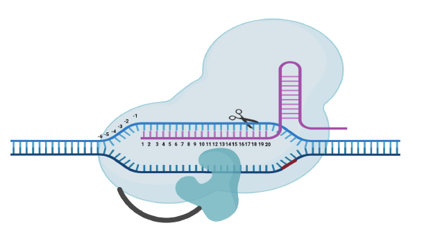

# CRISPR-BEERS
CRISPR Base Editor Exchange Repository: 
A taxonomic and phylogenetic classification of diverse base editors

This repository of CRISPR base editors can be used to rank subvariants against a protospacer sequence-of-interest given a target adenine or cytosine position. Users define the desired base editor traits as well as the position of the target nucleotide within their protospacer as an input to produce a ranked output that suggests the most ideal base editor for that particular application. Briefly, upon loading the dependencies associated with the script in Rstudio, the ShinyApp is launched and users can then filter through the database by first specifying the singular or non-singular effector status of the base editor. This partitions the selection of dual deaminases from single effector base editor subvariants. Next, the endonuclease can be specified, and further specification for the subtype can be made to indicate the PAM requirement, such as ‘strict’ or ‘relaxed.’ Traits such as reduced sgRNA-independent DNA off-target or reduced RNA off-targets effects, increased product purity or increased on-target editing can also be specified, whereas in situ target windows are defined by indicating target cytosine or adenine bases that are favoured or disfavoured for editing to account for bystander editing effects.

- To Run this application, download all files in this repository to the same folder, and then run the "CRISPRbeers.R" file.

- You will need to change the working directory in the line 7 of the script:
setwd("~/YOUR/WORKING/DIRECTORY")

- The target editing window can be selected and the numbering is based on the position within the sgRNA sequence:

<i>In addition to ABEs and CBEs, BEERS also incorporates dual deaminases as well as CGBEs. For CGBEs, only position 5 and position 6 of a given protospacer are considered, though BE-HIVE (https://www.crisprbehive.design/) should be consulted for a more detailed breakdown of CGBE editing outcomes. The database has been manually curated, while the scoring metrics for the ranked comparison of the in situ target window was derived from the published literature. While other webtools may provide information about the best sgRNA, none so far provide a specific recommendation about the particular base editor to use. </i>
